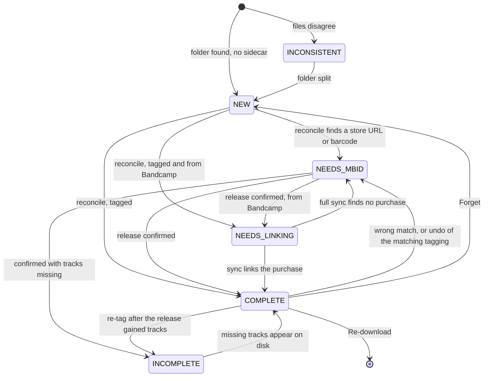

# The model

## An album is its release, not its folder

A library assembled over decades keeps one release in several places:
`Album/CD1` and `Album/CD2`, a box set filed disc by disc, a live album filed
under "Live Albums" away from the rest of the artist. Treating each folder as an
album gives several Library tiles, each holding a fraction of the tracklist and
each wrong about what it has.

So an album is **the files that name its MusicBrainz release**, wherever they
are. The scan reads every file's release ID anyway, so grouping on it costs
nothing extra. A folder with no release ID is still one album on its own; there
is nothing else to group it by.

There is deliberately **no containment rule**, such as "the folders must share a
parent". `Hybrid/Wide Angle` beside `Live Albums/Hybrid/Live Angle` is a
reasonable way to organise a library, and a boundary would forbid merges that are
correct anyway. The earlier rule based on directory nesting failed on exactly
this layout (#197).

### Duplicates must not merge

Dropping the boundary is safe only because two folders of one release are merged
only when they demonstrably hold *different tracks* of it:

- by **release-track IDs** when the files carry them. Different discs have
  disjoint sets and two copies of one disc have identical sets, so this reads
  what the folders hold rather than what they claim;
- otherwise by **distinct disc numbers**, which is weaker (what the files claim)
  but still exact;
- a folder with any untagged file, or a mixture of the two kinds of evidence, is
  never merged. With half the files untagged, two copies would compare as
  disjoint on the tagged half.

No evidence either way means no merge.

### Two copies get two identities

When the same release is on disk twice, each copy's ID is the release qualified
by where the copy lives. Without that, both tiles opened the same album, and an
action taken from either reached whichever copy the scan met first (#424). The
qualified ID is derived from the path rather than allocated, so it's the same on
every scan and can't move between copies as folders come and go. A release on
disk once keeps the bare release ID, which is every album in an ordinary library.

A link holding the bare release ID, written before a second copy appeared, opens
that copy while it's the only one and otherwise lists the copies rather than
choosing one. The copies share one history, because every event is recorded
against the sidecar's release, and each record names the folder it touched.

### Nothing on disk changes

Grouping is only a reading of what's there. Each folder keeps its own complete
sidecar, none is primary, and a folder moved out of the group is still a correct
album on its own. That's the point, because tolerating reorganised folders is
why this exists. The album's view of its sidecar is a merge of its folders'
sidecars, and anything the user decided about any part is taken as decided
about the album.

Anything that writes to an album must be given the album's files, not a folder:
tagging only the primary folder would silently leave the other discs on their old
tags.

## State is derived

Every album is in exactly one state, worked out from its sidecar and its files
each time Harmonist looks (see [principles](principles.md#state-is-derived-never-stored)).

| State | Derived when | Shown as |
|---|---|---|
| **Inconsistent** | The files in one folder disagree about which album they belong to. Checked first, whatever the sidecar says. | Inbox |
| **New** | There is no sidecar. | Inbox |
| **Needs MBID** | The sidecar names no release. A suggested release may be attached. | Inbox |
| **Tagging** | The sidecar names a release the files don't carry yet. | Inbox, briefly |
| **Needs Linking** | Tagged, from Bandcamp, and not yet linked to its purchase. | Inbox |
| **Incomplete** | Tagged, and fewer tracks are on disk than the files' own tags say the release has. | Library |
| **Complete** | Tagged, and nothing above applies. | Library |

A few choices in that table are worth explaining.

**Inconsistent is decided by release ID first.** When every file names the same
release, the folder is one album whatever its titles say: a ripper may fold a
disc's name into the album title, and that isn't two albums. Only when some file
has no release ID do the titles have to agree, since nothing else vouches for a
stray file dropped into the folder. There's no "ignore" action for Inconsistent,
because it would be a sidecar field that later needs hand-editing to undo.
Splitting the folder is the way out.

**Needs MBID is one state, suggestion or not.** An earlier design split it into
"needs review" and "needs MBID", which made swapping a wrong suggestion a round
trip through two states.

**Incomplete is read from the files.** A tagging writes the release's track and
disc totals into every file, as Picard does, so the expected count is already on
disk from the moment of tagging. An adopted library therefore shows Incomplete
immediately, with no lookups. Storing the count in the sidecar as well was tried
and removed (#195): it duplicated the tags, and could drift from them. Three
rules refine it:

- a disc entirely absent makes the album Incomplete with no known total, because
  that disc's length was recorded only in the files that are missing;
- files with no totals at all derive Complete, so an album Harmonist has never
  tagged isn't accused of missing tracks;
- a medium that is entirely absent *and entirely video* doesn't count, since
  Harmonist can't tag video and the user can't act on it. A partly present video
  disc still counts: having some of it suggests a failed rip, not a choice.

**An unreadable file makes the album Incomplete, not Tagging.** A file that
can't be opened is, for every purpose the user cares about, a track they don't
have. Tagging would invite a re-tag, which is a write to the drive that just
failed a read.

**Incomplete beats Needs Linking**, because a defect the user can act on should
be visible even on an unlinked Bandcamp album.

**Needs Linking has three exits besides a sync:** several purchases could be the
album and no rule can tell them apart (see [Bandcamp](bandcamp.md)); the user says
it wasn't bought on Bandcamp; or a full sync found no purchase and the user
accepted that. Each is recorded in the sidecar, because none can be derived.

### When the files and sidecar disagree

If the files consistently name a different release from the sidecar's, the files
win: the user re-tagged in Picard, as Harmonist asks them to, and reconcile
re-points the sidecar while keeping its store link and purchase, which are about
the same album. A re-tag in Picard that keeps the release but changes other tags
is noticed by the files being newer than the sidecar's last tagging, and the
sidecar's timestamp catches up.

### Transitions

**Re-download leaves the state machine.** Between the archive and the download,
the album has no folder, so it derives nothing. It's held in memory and shown as
an Inbox card until the replacement appears (see
[Bandcamp](bandcamp.md#re-download)).

## Identity

An album's ID is what links, history and actions hang on, so it has to be stable.

- A **matched album** is identified by its release's MBID, qualified by location
  when there are copies (above).
- An **unmatched album with a sidecar** carries a temporary ID in the sidecar,
  which moves with the folder if it's renamed.
- An **album with no sidecar** gets a hash of its path relative to the library
  root. Relative, so re-pointing a bind mount doesn't re-identify the library;
  hashed, because the ID goes in URL paths, where slashes don't survive reverse
  proxies. A rename re-identifies such an album, which is unavoidable without
  writing something to disk. An earlier random ID lost all of an album's history
  on every restart (#114).

IDs change: matching replaces a temporary ID with the MBID, and a MusicBrainz
merge replaces one MBID with another. The old ID is known only at the moment it
changes, so an alias from old to new is recorded then, and history follows the
chain of aliases. That's what keeps an album's history and old links intact
through re-identification.
